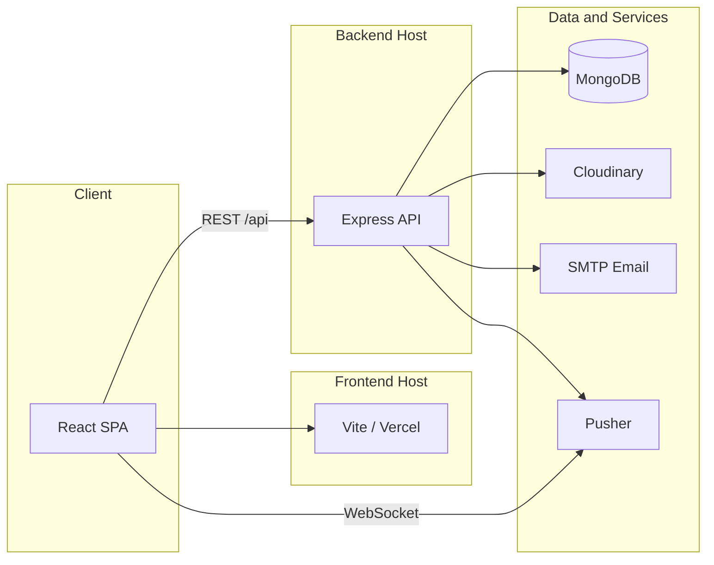

# Kite Brand Pakistan — Full-Stack Platform

Official corporate website and e-commerce platform for **Kite Brand Pakistan**, part of the **Aziz Group of Industries**. The application combines a public marketing site, product catalog, shopping cart, checkout flow, and a protected admin panel for catalog and order management.

**Production site:** [https://kitepk.com](https://kitepk.com)

---

## Table of Contents

- [Overview](#overview)
- [Features](#features)
- [Architecture](#architecture)
- [Technology Stack](#technology-stack)
- [Repository Structure](#repository-structure)
- [Prerequisites](#prerequisites)
- [Getting Started](#getting-started)
- [Environment Variables](#environment-variables)
- [Available Scripts](#available-scripts)
- [API Reference](#api-reference)
- [Admin Panel](#admin-panel)
- [Deployment](#deployment)
- [Local Development Notes](#local-development-notes)
- [Security Considerations](#security-considerations)

---

## Overview

This repository is a monorepo containing two independently deployable applications:

| Application | Directory  | Purpose                                      |
|-------------|------------|----------------------------------------------|
| Frontend    | `frontend/`| Public website, cart, checkout, admin UI     |
| Backend     | `backend/` | REST API, database, email, image uploads      |

The platform serves FMCG products under the Kite brand, including safety matches, detergents, and dish wash products. It also presents company information, export capabilities, and promotional product bundles.

Business divisions represented in the codebase include safety match manufacturing, FMCG, textiles, board products, and real estate. Product data and images are managed through the admin panel and stored in MongoDB, with media hosted on Cloudinary.

---

## Features

### Public Website

- Responsive homepage with hero carousel, certifications, and brand showcase
- Dynamic product catalog driven by API data
- Product detail pages with variants, brand sub-products, and image galleries
- Promotion and package bundles
- Shopping cart with `localStorage` persistence
- Checkout with Cash on Delivery (COD), Easypaisa, and JazzCash payment options
- Export information pages (safety matches, wooden splints)
- About Us page with company history, leadership, and timeline
- Contact page with WhatsApp integration
- SEO optimization: meta tags, Open Graph, JSON-LD structured data, sitemap

### Admin Panel

- JWT-authenticated admin login
- Product CRUD with Cloudinary image upload
- Promotion package management
- Order listing, detail view, and status updates
- Site settings (e.g. default shipping cost)
- Real-time order notifications via Pusher (when configured)

### Backend

- RESTful API with Express
- MongoDB persistence via Mongoose
- Order email notifications via Nodemailer
- CORS configuration for production and Vercel preview deployments
- Serverless-compatible entry point for Vercel deployment

---

## Architecture



**Request flow (checkout):**

1. User adds items to the cart on the frontend.
2. Checkout form is submitted to `POST /api/orders`.
3. Backend validates the payload, persists the order, and returns confirmation.
4. Email notification is sent asynchronously to the configured admin address.
5. A Pusher event is emitted for real-time admin notification (if configured).

---

## Technology Stack

### Frontend

| Technology        | Version / Notes                          |
|-------------------|------------------------------------------|
| React             | 19                                       |
| Vite              | 7                                        |
| React Router      | 7                                        |
| Tailwind CSS      | 4                                        |
| Framer Motion     | Animations                               |
| Swiper            | Carousels                                |
| react-helmet-async| SEO head management                      |
| react-hot-toast   | Notifications                            |
| Pusher JS         | Admin real-time notifications            |

### Backend

| Technology   | Version / Notes                          |
|--------------|------------------------------------------|
| Node.js      | ESM modules                              |
| Express      | 4                                        |
| MongoDB      | Via Mongoose 8                           |
| JWT          | Admin authentication                     |
| bcryptjs     | Password hash verification               |
| Nodemailer   | Order email delivery                     |
| Cloudinary   | Product image storage                    |
| Pusher       | Real-time order events                   |
| Jest         | API health check test                    |

---

## Repository Structure

```
kite-match-project---full-stack/
├── frontend/
│   ├── public/                 # Static assets, sitemap, robots.txt
│   ├── src/
│   │   ├── assets/             # Images, videos, brand media
│   │   ├── components/         # Reusable UI components
│   │   ├── context/            # React context (cart state)
│   │   ├── pages/              # Route-level page components
│   │   ├── services/           # API client
│   │   └── utils/              # SEO helpers
│   ├── index.html
│   ├── vite.config.js
│   └── vercel.json
│
├── backend/
│   ├── api/
│   │   └── [...all].js         # Vercel serverless handler
│   ├── scripts/
│   │   ├── seedMatches.js      # Seed safety matches product
│   │   ├── seedProductsCloudinary.js
│   │   ├── syncFromProduction.js
│   │   └── generateSitemap.js
│   ├── src/
│   │   ├── models/             # Mongoose schemas
│   │   ├── routes/             # Express route handlers
│   │   ├── utils/              # DB, email, auth, Cloudinary
│   │   ├── app.js              # Express application
│   │   └── index.js            # Local server entry
│   └── vercel.json
│
└── README.md
```

---

## Prerequisites

- **Node.js** 18 or later
- **npm** 9 or later
- **MongoDB** 6 or later (local instance or MongoDB Atlas)
- Optional: Cloudinary account (image uploads in admin)
- Optional: SMTP credentials (order email notifications)
- Optional: Pusher account (real-time admin notifications)

---

## Getting Started

### 1. Clone the repository

```bash
git clone https://github.com/00tatheer00/kite-match-project---full-stack.git
cd kite-match-project---full-stack
```

### 2. Configure environment variables

Create `backend/.env` and `frontend/.env` using the templates in [Environment Variables](#environment-variables).

### 3. Install dependencies

```bash
cd backend && npm install
cd ../frontend && npm install
```

### 4. Start MongoDB

Ensure a MongoDB instance is running locally, or set `MONGODB_URI` to a MongoDB Atlas connection string.

Default local connection (used when `MONGODB_URI` is unset):

```
mongodb://127.0.0.1:27017/kite
```

### 5. Sync product data (recommended for local development)

A fresh local database will not contain products or images. Sync from the production API:

```bash
cd backend
npm run sync:production
```

This imports all products and promotions, including Cloudinary image URLs.

### 6. Start the backend

```bash
cd backend
npm run dev
```

The API will be available at `http://localhost:5000/api`.

### 7. Start the frontend

In a separate terminal:

```bash
cd frontend
npm run dev
```

The website will be available at `http://localhost:5173`.

---

## Environment Variables

### Backend (`backend/.env`)

```env
# Server
PORT=5000
MONGODB_URI=mongodb://127.0.0.1:27017/kite
FRONTEND_ORIGIN=http://localhost:5173

# Admin authentication
ADMIN_EMAIL=admin@example.com
ADMIN_PASSWORD_HASH=$2a$10$replace_with_bcrypt_hash
ADMIN_JWT_SECRET=replace-with-strong-secret

# Order email notifications
ADMIN_ORDER_EMAIL=orders@example.com
SMTP_HOST=smtp.example.com
SMTP_PORT=587
SMTP_SECURE=false
SMTP_USER=your-smtp-user
SMTP_PASS=your-smtp-password
SMTP_FROM=noreply@example.com

# Cloudinary (required for admin image uploads)
CLOUDINARY_CLOUD_NAME=your-cloud-name
CLOUDINARY_API_KEY=your-api-key
CLOUDINARY_API_SECRET=your-api-secret

# Pusher (optional — real-time admin notifications)
PUSHER_APP_ID=
PUSHER_KEY=
PUSHER_SECRET=
PUSHER_CLUSTER=

# Production sync script (optional override)
SYNC_SOURCE_API=https://kite-backend-eux7.onrender.com/api
```

**Notes:**

- If `SMTP_HOST` is not set, Nodemailer uses `jsonTransport` (emails are logged, not sent). Suitable for local development.
- Generate an admin password hash:

  ```bash
  node -e "import('bcryptjs').then(async (b)=>{console.log(await b.default.hash('your-password',10));})"
  ```

### Frontend (`frontend/.env`)

```env
# API base URL
VITE_API_BASE_URL=http://localhost:5000/api

# Pusher (optional — admin notification center)
VITE_PUSHER_KEY=your-pusher-key
VITE_PUSHER_CLUSTER=ap2
```

For production or when skipping local backend setup:

```env
VITE_API_BASE_URL=https://your-backend-host.com/api
```

---

## Available Scripts

### Backend

| Command                    | Description                                      |
|----------------------------|--------------------------------------------------|
| `npm run dev`              | Start development server with nodemon            |
| `npm start`                | Start production server                          |
| `npm test`                 | Run Jest test suite                              |
| `npm run sync:production`  | Import products and promotions from live API     |
| `npm run seed:products:cloudinary` | Upsert base product records            |
| `npm run seo:generate-sitemap`     | Generate sitemap XML                   |
| `npm run images:to-webp`           | Convert images in a folder to WebP     |

### Frontend

| Command           | Description                          |
|-------------------|--------------------------------------|
| `npm run dev`     | Start Vite development server        |
| `npm run build`   | Build for production                 |
| `npm run preview` | Preview production build locally     |
| `npm run lint`    | Run ESLint                           |

---

## API Reference

Base URL: `/api`

### Health

| Method | Endpoint       | Description        |
|--------|----------------|--------------------|
| GET    | `/api/health`  | Service health check |

### Public Endpoints

| Method | Endpoint              | Description                    |
|--------|-----------------------|--------------------------------|
| GET    | `/api/products`       | List all products              |
| GET    | `/api/products/:id`   | Get product by custom `id`     |
| GET    | `/api/promotions`     | List promotion packages        |
| GET    | `/api/promotions/:id` | Get promotion by custom `id`   |
| GET    | `/api/settings`       | Get public site settings       |
| POST   | `/api/orders`         | Create a new order             |

### Order Types

Orders support three `type` values:

- `product` — single product order (requires `productId`)
- `promotion` — promotion bundle order (requires `promotionId`)
- `cart` — multi-item cart checkout (requires `items` array)

**Required fields for all orders:**

- `customerName`, `phone`, `email`, `address`, `city`
- `paymentMethod`: `COD` | `Easypaisa` | `JazzCash`

Phone numbers must match Pakistani mobile format: `03XXXXXXXXX`, `+923XXXXXXXXX`, or `923XXXXXXXXX`.

### Admin Endpoints

All admin routes require a valid JWT in the `Authorization` header:

```
Authorization: Bearer <token>
```

| Method | Endpoint                        | Description              |
|--------|---------------------------------|--------------------------|
| POST   | `/api/admin/login`              | Admin login, returns JWT |
| GET    | `/api/admin/products`           | List products            |
| POST   | `/api/admin/products`           | Create product           |
| PUT    | `/api/admin/products/:id`       | Update product           |
| DELETE | `/api/admin/products/:id`       | Delete product           |
| GET    | `/api/admin/promotions`         | List promotions          |
| POST   | `/api/admin/promotions`         | Create promotion         |
| PUT    | `/api/admin/promotions/:id`     | Update promotion         |
| DELETE | `/api/admin/promotions/:id`     | Delete promotion         |
| GET    | `/api/admin/orders`             | List orders              |
| GET    | `/api/admin/orders/:id`         | Get order by MongoDB `_id` |
| PATCH  | `/api/admin/orders/:id/status`  | Update order status      |

**Order status values:** `pending`, `confirmed`, `shipped`, `cancelled`

**Important:** Product and promotion routes use the custom `id` field (e.g. `safety-matches`). Admin order routes use the MongoDB `_id`.

For the complete API specification, see [`backend/README.md`](backend/README.md).

---

## Admin Panel

Access the admin panel at `/admin/login` on the frontend host.

| Route               | Purpose                        |
|---------------------|--------------------------------|
| `/admin/login`      | Admin authentication           |
| `/admin/products`   | Product management             |
| `/admin/promotions` | Promotion package management   |
| `/admin/orders`     | Order management               |
| `/admin/settings`   | Site configuration             |

Admin sessions use JWT tokens with an 8-hour expiry. Tokens are stored in browser `localStorage`. Unauthenticated requests to admin routes return `401` and redirect to the login page.

---

## Deployment

### Frontend (Vercel)

1. Import the `frontend/` directory as a Vercel project.
2. Set `VITE_API_BASE_URL` to your deployed backend API URL.
3. Set `VITE_PUSHER_KEY` and `VITE_PUSHER_CLUSTER` if using real-time notifications.
4. Deploy. The `vercel.json` rewrite rule handles client-side routing.

### Backend (Vercel or Render)

**Vercel (serverless):**

1. Import the `backend/` directory as a Vercel project.
2. Configure all required environment variables in the Vercel dashboard.
3. The `api/[...all].js` handler serves all `/api/*` routes.

**Render / traditional Node host:**

1. Set `npm start` as the start command.
2. Configure environment variables.
3. Ensure `FRONTEND_ORIGIN` matches your deployed frontend URL.

### Required production environment variables

| Variable            | Required | Purpose                        |
|---------------------|----------|--------------------------------|
| `MONGODB_URI`       | Yes      | Database connection            |
| `FRONTEND_ORIGIN`   | Yes      | CORS allowed origin            |
| `ADMIN_EMAIL`       | Yes      | Admin login email              |
| `ADMIN_PASSWORD_HASH` | Yes    | Admin password (bcrypt hash)   |
| `ADMIN_JWT_SECRET`  | Yes      | JWT signing secret             |
| `CLOUDINARY_*`      | Yes      | Image upload in admin          |
| `SMTP_*`            | Recommended | Order email notifications   |
| `PUSHER_*`          | Optional | Real-time admin notifications  |

---

## Local Development Notes

### Empty product catalog

If only one product appears or images are missing after a fresh setup, the local database likely contains incomplete seed data. Run:

```bash
cd backend
npm run sync:production
```

This pulls the full catalog and Cloudinary image URLs from the production API into your local MongoDB.

### Using the production API directly

Alternatively, point the frontend at the live backend without running a local API:

```env
VITE_API_BASE_URL=https://kite-backend-eux7.onrender.com/api
```

Restart the Vite dev server after changing `.env` files.

### CORS

The backend allows origins defined in `FRONTEND_ORIGIN` and `FRONTEND_ORIGINS` (comma-separated). In development, `http://localhost:5173` is allowed automatically when no origin is configured.

---

## Security Considerations

- Never commit `.env` files. They are excluded via `.gitignore`.
- Set a strong, unique `ADMIN_JWT_SECRET` in all non-local environments.
- Store `ADMIN_PASSWORD_HASH` as a bcrypt hash, never as plain text.
- Rotate Cloudinary, SMTP, and Pusher credentials if they are ever exposed.
- Admin routes are protected by JWT middleware; public routes are read-only except for order creation.
- Order email delivery is fire-and-forget: order creation succeeds even if email sending fails.

---

## Related Documentation

- [`backend/README.md`](backend/README.md) — Detailed backend API and integration guide
- [`frontend/docs/seo-image-optimization.md`](frontend/docs/seo-image-optimization.md) — SEO and image optimization notes

---

## License

Proprietary. All rights reserved by Kite Brand Pakistan / Aziz Group of Industries.
